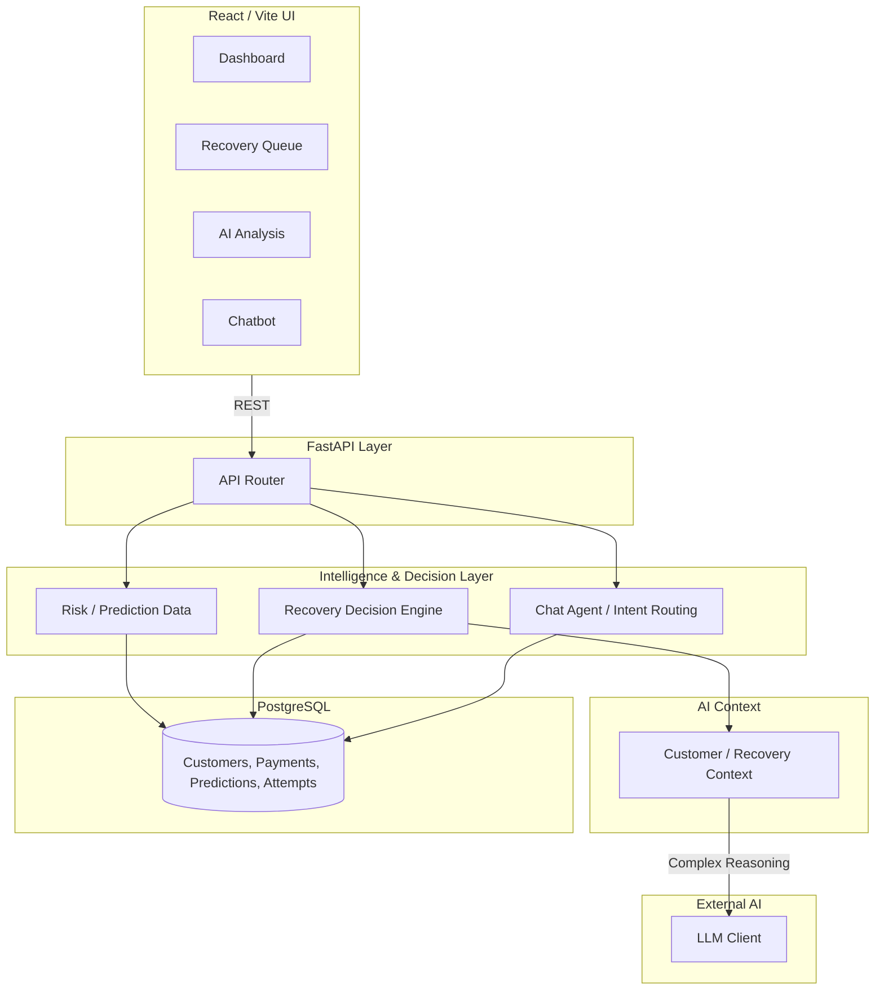

# Razorpay AI Revenue Recovery Engine

**Identify → Prioritize → Reason → Recover**

Razorpay AI Revenue Recovery Engine is an AI-assisted revenue recovery platform that identifies high-risk transactions, quantifies financial exposure, analyzes customer behavior, prioritizes recovery opportunities, recommends recovery strategies, and tracks recovery outcomes through a merchant-facing dashboard.


---

## Why This Exists

**The Problem**: Payment failures cause immediate revenue leakage. Generic retry logic ignores customer behavior and varied failure causes (e.g., fraud block vs. insufficient funds), resulting in permanent loss. Furthermore, operations teams lack visibility into which failures carry the highest financial impact.

**The Solution**: This engine models revenue recovery as an intelligent prioritization and orchestration problem rather than a basic retry loop. It calculates absolute financial exposure, uses an LLM exclusively for targeted diagnosis rather than raw business logic, and tracks explicit operational recovery states.

---

## System Architecture



---

## End-to-End Workflow

```text
Transaction Data
       ↓
Risk Scoring
       ↓
Revenue at Risk
       ↓
Customer Intelligence
       ↓
Recovery Decision
       ↓
AI Reasoning
       ↓
Recovery Attempt
       ↓
Outcome & Analytics
```

---

## ML / Risk Engine

The system does not just classify payments as "failed"; it calculates the exact monetary exposure to prioritize operations.

```text
Raw Transactions
      ↓
Feature Engineering (e.g., historical success rate, average transaction value)
      ↓
Risk Prediction (ML Scoring)
      ↓
Failure Probability
      ↓
Revenue at Risk
      ↓
Estimated Recoverable Revenue
      ↓
Priority Tier (Critical, High, Medium, Low)
```

**Financial Model Example**:
Failure probability alone is insufficient. A low-value transaction with a 99% failure probability has less business impact than a high-value transaction with an 80% failure probability.

```text
Transaction amount = ₹100,000
Failure probability = 0.80

Revenue at Risk = 100,000 × 0.80 = ₹80,000

Estimated recovery probability = 0.60
Estimated Recoverable Revenue = 80,000 × 0.60 = ₹48,000
```

This calculation forces the operational queue to be sorted by pure business impact.

---

## AI Agent & LLM Architecture

**Why the LLM is not the decision engine**

The system deliberately separates deterministic recovery decisioning from LLM-based reasoning. Financial calculations, risk prioritization, recovery state transitions, and database operations remain programmatically controlled. The LLM is used where contextual reasoning provides additional value: diagnosis, evidence synthesis, recommendation explanation, confidence assessment, and escalation reasoning.

```text
                    Recovery Case
                         │
                         ▼
              Deterministic Signals
                         │
                         ▼
                 Decision Engine
                         │
                         ▼
                 Context Builder
                         │
                         ▼
                      LLM
                         │
                         ▼
              Structured Assessment (Pydantic Schema)
```

**Intent Routing for Cost Control**
To prevent unbounded LLM costs, routine operational queries (e.g., "What is my total exposure?") are intercepted by heuristic routing and resolved instantly via `SQLAlchemy` aggregations, bypassing the LLM entirely.

---

## Recovery Engine

The core operational value is explicit state tracking.

```text
Payment
  │
  ├── Amount
  ├── Payment Method
  └── Customer
       │
       ▼
Risk Assessment (Failure Prob, Revenue at Risk, Anomalies)
       │
       ▼
Recovery Decision
       │
       ├── Retry
       ├── Alternative Method
       ├── Immediate Recovery
       └── Manual Review
       │
       ▼
Recovery Attempt (Pending)
       │
       ▼
Outcome (Successful / Failed)
```

Every attempt creates a strict lifecycle transition in PostgreSQL, ensuring recovered revenue is tracked accurately without duplicates.

---

## Key Engineering Decisions

| Decision                             | Reason                                                                   |
| ------------------------------------ | ------------------------------------------------------------------------ |
| **FastAPI**                    | Lightweight, asynchronous, typed API layer utilizing Pydantic.           |
| **PostgreSQL**                 | Persistent relational recovery state tracking (ACID compliance).         |
| **Separate decision engine**   | Keeps core business logic deterministic and safe from LLM hallucination. |
| **Structured LLM output**      | Forces AI results into a JSON schema consumable by application UI logic. |
| **Rule-based chatbot routing** | Avoids unnecessary LLM calls for simple operational aggregations.        |

---

## Current Prototype → Production Evolution

This repository demonstrates the intelligence and orchestration prototype. Deploying to production requires hardening the asynchronous boundaries.

**CURRENT**

```text
React → FastAPI → PostgreSQL
              ↓
        AI / ML Engine
```

**PRODUCTION EVOLUTION**

```text
React
  ↓
API Gateway
  ↓
FastAPI
  ↓
Async Recovery Workers (Celery / Redis)
  ↓
Payment Provider (e.g., live Razorpay endpoints)
  ↓
Webhooks
  ↓
PostgreSQL
```

**Supporting Infrastructure Upgrades:**

1. **Async Workers**: Decouple slow LLM inference from HTTP request cycles.
2. **Webhooks**: Event-driven ingestion of payment outcomes rather than static datasets.
3. **Authentication**: RBAC and merchant-level isolation via OAuth/JWT.
4. **Idempotency**: API keys ensuring safe retries without double-charging.
5. **Observability**: Structured metrics for feature drift and AI recommendation bias.

---

## Tech Stack

- **Backend**: Python 3.11, FastAPI, Uvicorn, SQLAlchemy, Pydantic
- **Database**: PostgreSQL
- **Frontend**: React 19, Vite, Recharts, Lucide
- **AI**: OpenRouter API (gpt-4o)
- **Testing**: Pytest

---

## Getting Started

```bash
# 1. Clone repository
git clone <repo-url>
cd RazorPay

# 2. Set up Backend
python -m venv .venv
source .venv/Scripts/activate
pip install -r requirements.txt

# 3. Environment Variables (.env)
DATABASE_URL=postgresql://postgres:<password>@localhost:5432/postgres
OPENROUTER_API_KEY=your_openrouter_api_key

# 4. Initialize Database
python database/create_db.py
python scripts/load_recovery.py --reset --confirm-reset

# 5. Start Services
uvicorn api.main:app --reload
# (In a new terminal)
cd frontend && npm run dev
```

---

## Author

**Anmol Jana**
